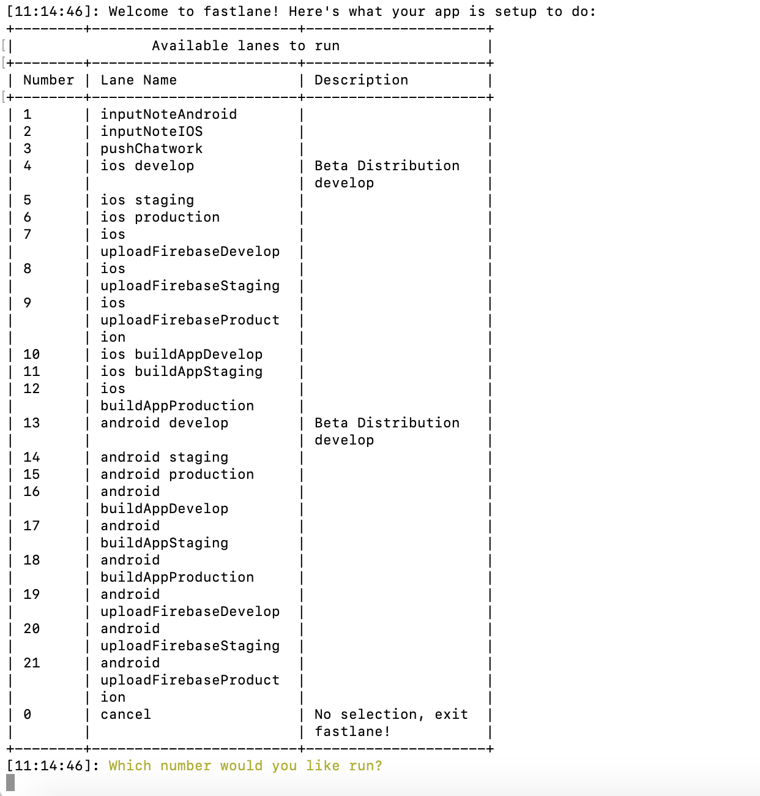

# Fastlane 

The easiest way to build and release mobile apps. Fastlane handles tedious tasks so you don’t have to. 

Link ref : https://fastlane.tools/ 

#### Requirements Install 
[Python](https://www.python.org/)  
[RubyGems](https://rubygems.org/) or [Homebrew](https://brew.sh/)

[Cookiecutter](https://cookiecutter.readthedocs.io/en/1.7.0/installation.html)  
[Firebase CLI](https://firebase.google.com/docs/cli#install_the_firebase_cli)  

#### Install

+ Install Fastlne 
```
# Using RubyGems
sudo gem install fastlane -NV

# Alternatively using Homebrew
brew install fastlane 
```

+ Install Firebase  app distribution

 ```
 fastlane add_plugin firebase_app_distribution
 ```
+ Init fastlane folder 
```
cookiecutter https://github.com/framgia/The-High-Template-Coding.git --checkout fastlane 
```
Then input some informartion in terminal  . You will be prompted to enter a bunch of project config values. Next , will generate a project from the template, using the values that you entered. It will be placed in your current directory.

#### Additional some key information

In file `fastlane/.env.secret` additional some key , follow table above : 

| KEY | Mean |  Reference |
| -------- | -------- | -------- |
| `FIREBASE_ANDROID_APP_DEV FIREBASE_IOS_APP_DEV `     |  Your app's Firebase App ID. You can find the App ID in the Firebase console, on the General Settings page .For each environment there will be corresponding APP ID  |  [APP ID ](https://console.firebase.google.com/u/0/project/_/settings/general/)     |
| `FIREBASE_GROUP_TESTER`     | 	The tester groups you want to invite . Groups are specified using group aliases, which you can look up in the Firebase console. | [Manage Testers ](https://firebase.google.com/docs/app-distribution/manage-testers)     |
| `CHATWORK_API_TOKEN`     | TOKEN Account boot ChatWork   |      |
| `CHATWORK_ROOM_ID`     | RoomID ChatWork you want send notification   |      |
| `CHATWORK_SEND_TO_TESTER`     |  List UserId ChatWord you want send direct message |      |
| `BUILD_IOS_NAME`     |   |      |
| `SCHEME_NAME_IOS`     |   |      |

#### Run fastlane 
In root project , run command : 

```
fastlane 
```
Next ,in terminal will show table for some lane as image below :  



Then select number represent for the lane .

Description  lane 
| Lane | Mean |  Reference |
| -------- | -------- | -------- |
| develop , staging ,production | Platform iOS/Android  lane  will run build and distribute to Firebase for each environment develop ,staging,production|       |
| buildAppDevelop , buildAppStaging , buildAppProduction | Platform iOS/Android only build and generate APK/ipa file  |   |
| uploadFirebaseDevelop , uploadFirebaseStaging , uploadFirebaseProduction | Platform iOS/Android only distribute to Firebase|      |
