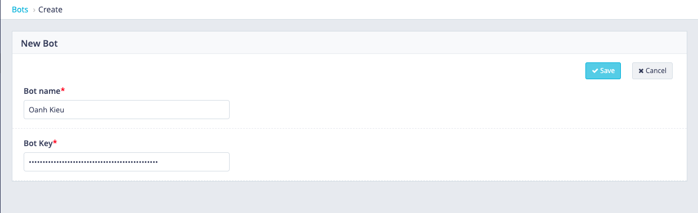
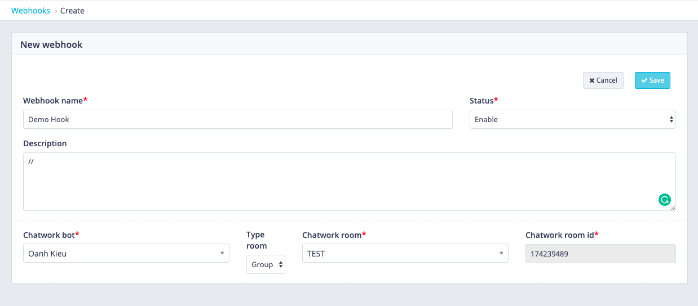
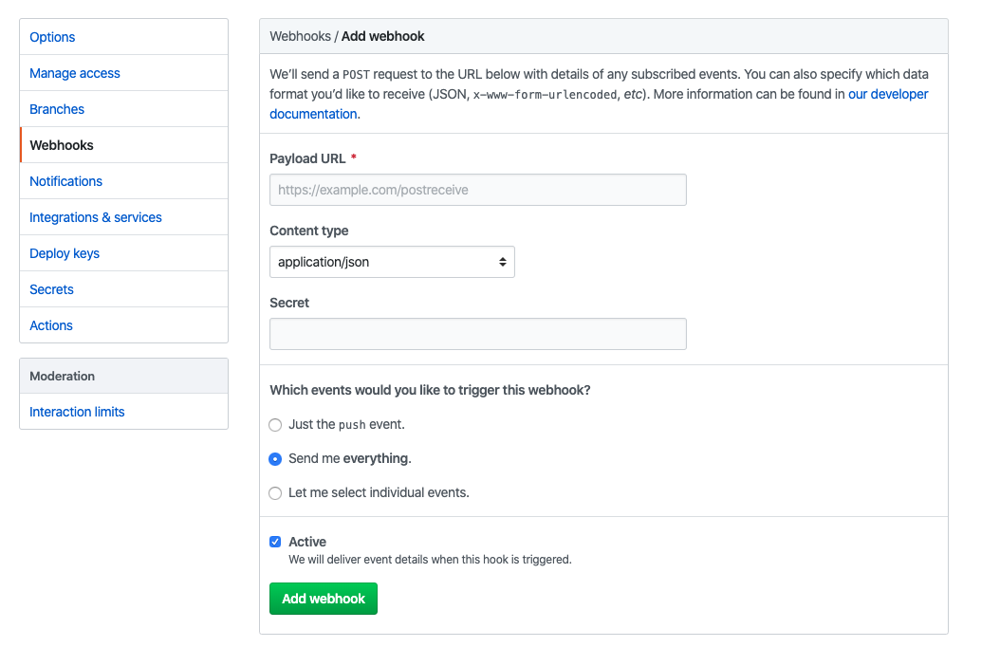
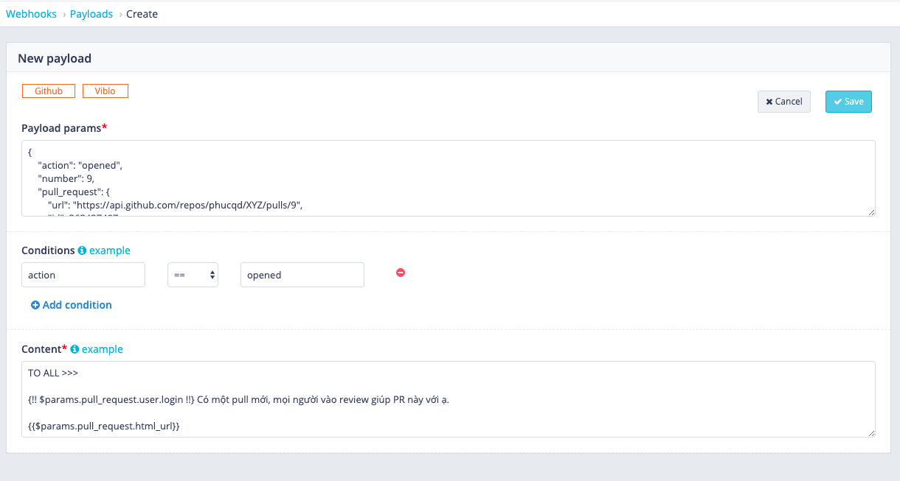
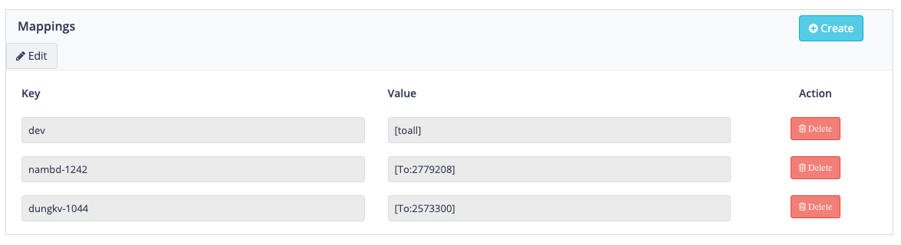

# Chatwork forwarder
### Link: https://cw-forwarder.sun-asterisk.vn
### Chatwork forwarder configuration steps:
# Pre-condition:  
1. Chatwork Bot Token
2. Add Bot to project
3. Github repo (your account role must be an admin or owner)

# Config
### Step 1: Create Bot
- In the dashboard, click Bots and then create a bot.
- Enter Bot name and Bot Token (Bot Key)

### Step 2: Create webhook
- In screen create webhook, enter "Webhook Name"
- Then, select a bot created in Step 1 in Chatwork bot drumroll.
- Then, you can select type room for notice: Group, Private, All
- Then, you can select a room to receive a message from bot. (This will list all group that your bot is joined)
- After all, click Save

### Step 3: Add webhook to Github repo
- Go to Settings
- Select Webhooks
- Add webhook
+ You need to copy webhook URL that created in Step 2 and pastes it to Payload URL.
+ Change Content type from "application/x-www-form-urlencoded" to "application/json"
+ Then, then change select "Send me everything" from "Which events would you like to trigger this webhook?"
- Then click Update

### Step 4: Setup message based on payload data
-  Back to Chatwork forwarder.
- Open webhook created in Step 2.
- Scroll to Payloads, then create payload
- For each event that github push to webook, you will get a payload data, use it to config message.

### Step 5: Config mapping data
- You can replace some key with definition value.
Example: 

